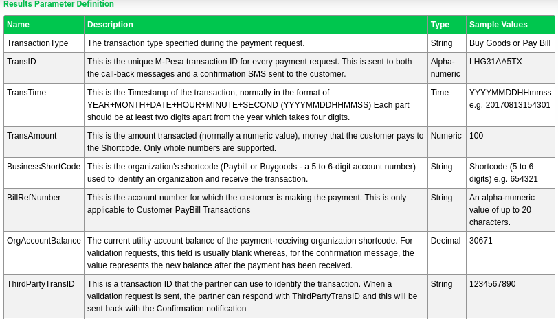
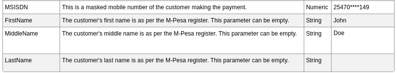
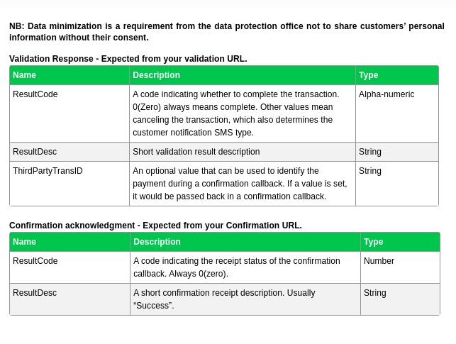
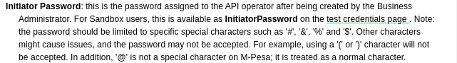

### How to implement C2B

"The trials you encounter will introduce you to your new strengths, remain steadfast and one day you will build something that endures, something worthy of your potential." - Epictetus.
***

First of all you have to register 2 URLS that safaricom will send data to when a transaction happens.

Lets say your domain is https://foobar.com and you have intergrated c2b in your app/web app.

Safaricom will need you to register 2 endpoints one for validation
and 2 for confirmation.

Lets call the validation endpoint as https://foobar.com/validate-c2b.

Lets call the confirmation endpoint as https://foobar.com/confirm-c2b.

!NOTE: You only need to register this endpoints once. so if you are automating this using code, make sure it runs only once. 

If you are using sandbox its ok to register multiple times, but in production make sure they are registered once. So make sure your function runs only once.

If you happen to change the validation or confirmation endpoint. you can delete them just log into daraja account and go to self-service then register using URL API or email safaricom themselves at mailto:apisupport@safaricom.co.ke for assistance.


### Requirements for the URLs you send to daraja api
- They must be HTTPS, but on sandbox you are allowed to use HTTP. In production use HTTPS.
- Use publicly available (Internet-accessible) IP addresses or domain names.
    - if you are on localhost, you can use ngrok or localtunnel - search them up on google, they are easy to use. They allow your localhost to be available worldwide.
-   Do not use public URL testes like ngrok in production. The api will block them.

What do I mean by register? I mean sending a post request to the c2b register url:
https://sandbox.safaricom.co.ke/mpesa/c2b/v1/registerurl


Before you send the one time api request, am assuming you are going live/production, this is how the request body should look like.

!NOTE: The word `Cancelled` and `Completed` MUST be in Sentence Case.
You can google what sentence case is.

### registering the Validation and Confirmation URL

```json
{    
   "ShortCode": "601426", // this is your paybill
   "ResponseType":"[Cancelled/Completed]", // So what do this two values mean, these values mean that when safaricom cannot find our Validation or Confirmation URL endpoint, it should reject or complete depending on the value you put. A good scenarion is when your api/server is down and someone wants to deposit money. Its up to you to decide.
   "ConfirmationURL":"[confirmation URL]", // This is the URL that receives the confirmation request from Safaricom API upon payment completion.
   "ValidationURL":"[validation URL]" //This will recive validation request from the api upon payment submission. By default External validation is disabled, i think you can enable it.
}
```


### After registering safaricom will return such a response

Response Body
```json
    "OriginatorCoversationID": "7619-37765134-1", // this is a global unique identifier for the transaction request returned by the API upon successful request.
    "ResponseCode": "0", // this indicates whether mobile money accepts the request or not.
    "ResponseDescription": "success" // this tells you the status of the request
```

NB: Before any API request register URL is included, you will require authorization by generating an access token from the authorization API to allow you successfully make an API call.

I will put a tutorial in this readme on how to generate access token.

Once you’ve registered URLs as explained above, C2B API payment transaction is initiated by the customer when they are paying. You can use the simulator to have an overview of how the request looks. You don’t need to develop anything on your side for this part.


Upon successful payment, we post the payment details to your confirmation and validation URLs as explained in the resulting body below;


Its not over yet.

Once a transaction happens, safaricom will send this type of data to your Validation URL that is https://foobar.com/validate-c2b

This validation will be received if you have External Validation feature enabled on their Paybill or BuyGoods (Till Number) and require validating a payment  before M-PESA completes the transaction.

The Confirmation and Validation result posted on your URLs will have the structure below.

This is how the endpoints will receive.

This means your endpoints must accept post requests.

This is how you do it in fast api.
```python
@app.post("/validate-c2b")
@app.post("/confirm-c2b")
```

This is how it looks

```json
{    
   "TransactionType": "Pay Bill", // can be "Buy Goods"
   "TransID":"RKTQDM7W6S", // this is important so save to database, this is send back with callback also in the confirmation endpoint.
   "TransTime":"20191122063845", // this is also important(replace the time column with this in the database)
   "TransAmount":"10" // this is important so save to database
   "BusinessShortCode": "600638",
   "BillRefNumber":"invoice008", // also this save to database
   "InvoiceNumber":"", // also this save to database
   "OrgAccountBalance":""
   "ThirdPartyTransID": "",
   "MSISDN":"25470****149", // this is what you save in database
   "FirstName":"John", //  also this save to database
   "MiddleName":"" //  also this save to database
   "LastName":"Doe" //  also this save to database
}
```


#### Validation Response, once the api sends the data to you.

Once the api sends the above data to you, you are required to respond.

Examples use cases:

- You can verify that the phone exist in the database.
- You can check if the amount is in range, for example mtaanifx. does not accept any value below 10,000 and above 100,000 kenya shillings.


Afer validating you can respond in two ways, accept or reject.

You accept by sending the JSON data below back to daraja.

Make sure if you are accepting, the value is like this.
```json
{    
   "ResultCode": "0",
   "ResultDesc": "Accepted",
}
```


To reject a transaction, lets say the number is not in the database or the money is too much.
You send the below JSON.

But wait. there are error codes the api expects
here is the table for the ResultCode.

ResultCode        ResultDesc
***
C2B00011          Invalid MSISDN

C2B00012          Invalid Account Number

C2B00013          Invalid Amount

C2B00014          Invalid KYC Details

C2B00015          Invalid Shortcode

C2B00016          Other Error

```json
{    
   "ResultCode": "C2B00011",
   "ResultDesc": "Rejected",
}
```

Make sure its like that. The result code you will send depending on the error occurred.

Here is the description of what the validation endpoint values mean



Here is a continuation of the above image.





THIS is the last part of c2b implementation and registering of confirmation and validation url



For validation as you can see in the validation part a third value is optional.

The value is called `ThirdPartyTransID` if this value is set it will be sent back with the confrimation url.

Example
Maybe you can write a function that generates values for this `ThirdPartyTransID`. 
An example use case put the date that the transaction happened plus some random values that you only know. 

For the confirmation URL, only two values are required as you can see in the photo.


#### END NOTE
After understanding what I just wrote, its up to your imagination to do what you want depending on the system you are building.

If you notice a typo or some error you can request a change.


### END OF C2B


## START OF B2C, Business to customer
Am assuming you are testing on sandbox.

This is the endpoint for b2c:

https://sandbox.safaricom.co.ke/mpesa/b2c/v3/paymentrequest


B2C is an API used to make payments from a Business(mtaanifx) to Customer. It is also known as Bulk Disbursements.
For you to use this API you need to apply for Bulk Disbursment Account and get a shortcode
STEPS TO IMPLEMENT

1. set all parameters correct and send post request to the b2c endpoint.

#### important info
- Initiator Username - this is the API operator's username as it is on the portal 
where the user was created. For sandbox users, your initiator name is already there in the sandbox.

The initiators for the sandbox is: `testapi`


- Initiators Password - this is the password assigned to the API operator after being created by the business administrator. For sandbox users, this password is
`Safaricom999!*!`

If you are creating your password, it should be limited to some characters or the request will not be accepted by daraja.
Here is what safaricom says about the password requirements:



- Public Key certificate - this is the certificate used to encrypt the initiator's plaintext password for use in the API calls.